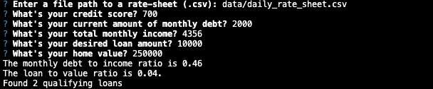

# Loan-Qualifier-Questionaire

This is a command-line interface application written in python that finds the qualifying loans by prompting the user. 

---

## Technologies

**This project uses python 3.7 and the following packages:**

* [fire](https://pypi.org/project/fire/)  - command line interface that fires off your command

* [questionary](https://pypi.org/project/questionary/) - for user prompts and dialog

---

## Installation Guide 

**Before running application you need to install the following:**

`pip install fire`

`pip install questionary`

---

## Usage

To use the Loan Quaifier Questionaire clone the repository and run the `app.py` 

`python app.py`

After running you will be prompted with questions that will be help find a list of qualifying loans for you. 

**Please make sure you answer each question as accurrate as possible.** 

You will be promoted to save your qualifying loans to a csv if your total number of qualifying loans is greater than 0. 

---

## Contributors

Nadirah Durr

nadirahdurr@yahoo.com

---

## License

MIT

---

